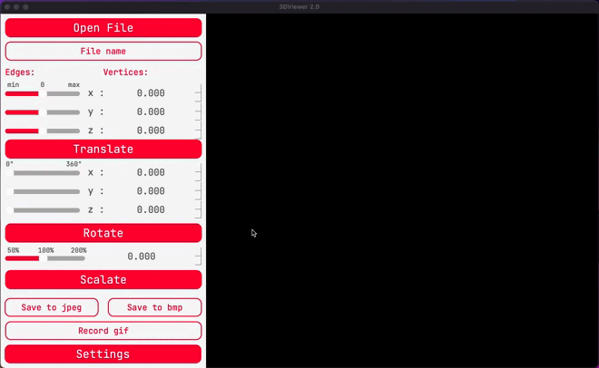
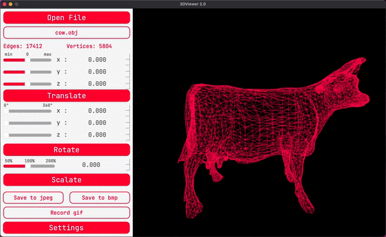
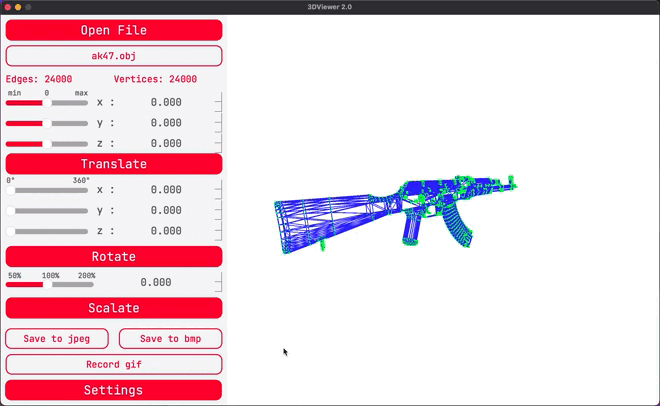
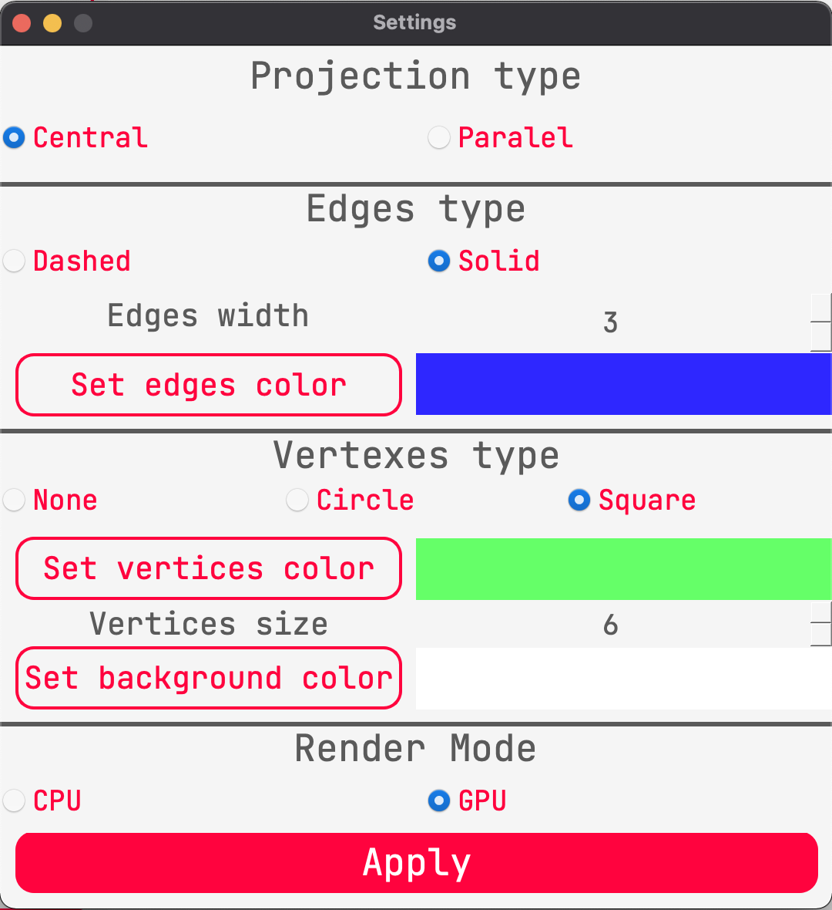

# 3D Viewer v1.0

## Content

This project allows you to read files with the `.obj` extension and visualize the read information as a 3d image. It is possible to change the image in real time, namely shift along 3 axes, rotate along 3 axes and scale. There are display settings, the ability to record gif images and save the current image to jpeg and bmp files. The program saves settings between work sessions in a config file. Hot keys and mouse are provided.

For installation:

    git clone https://github.com/sav1nbrave4code/3DViwer_v1.0
    cd 3DViwer_v1.0/src
    make install && make run

## Rendering

To display an object in the application, open the file with the `open file` button, or with the `O` key on the keyboard.
After selecting a file in the dialog box, it will be displayed on the screen, and the values ​​of the number of vertices and lines will also be displayed.

## Athene transformations

In addition to simply displaying an object, the program provides operations for affine transformations, namely, shifting and rotating along the axes `x` , `y` , `z`, and scaling the entire image.
These operations use both their own affine transformation matrices and opengl functions, depending on the mode of operation (more on that later).
To use operations you can use:

1) Buttons
2) Sliders
3) Mouse (`rb` - offset, `lb` - rotation, `wheel` - scaling)
 
 

## Settings

You can customize the display format, namely:

1) Line color
2) Background color
3) Vertex color
4) Line thickness
5) The thickness of the vertices
6) Type of vertices
7) Projection type
8) Render Mode
All settings are saved between program sessions in the configuration file `settings.config`.

## Saving files

The existing image on the stage can be saved using the buttons

1) `Save to jpeg` - save to jpeg file format
2) `Save to bmp` - save to bmp file format
3) `Record gif` - will record a gif image lasting 5 seconds at 10 fps.

## Hotkeys

1) `Space` - open settings.
2) `J` - saving the image in jpeg format.
3) `B` - save the file in bmp format.
4) `G` - write gif image.
5) `Escape` - exit from the application.
6) `Mouse lb` - object offset.
7) `Mouse rb` - object rotation.
8) `Mouse wheel` - object scaling.

The work was done by Anton Savin and Andrey Degtyarev.
