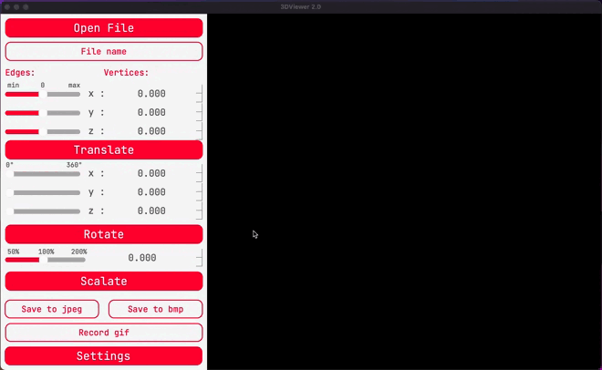
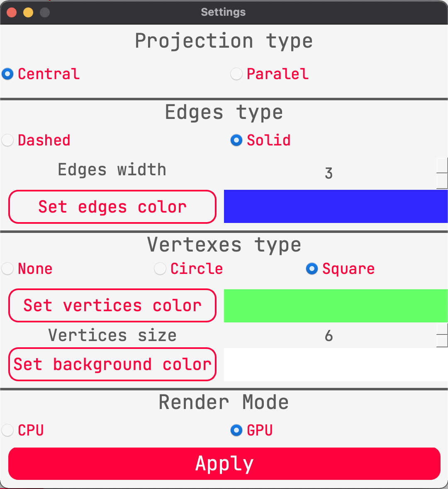

# 3DViewer v1.0

## Содержание

Данный проект позволяет считывать файлы с расширением `.obj` и визуализировать считанню информацию в виде 3d изображения. Есть возможость изменять изображение в режиме реального времени, а именно смещать по 3-м осям, вращать по 3-м осям и масштабировать. Есть настройки отображения, возможность записи gif изображения и сохранения текущего изображения в файлы jpeg и bmp расширений. Программа сохраняет настройки между сессиями работы в config файл. Предусмотрено использование горячих клавиш и мышки.

## Отрисовка

Чтобы отобразить объект в приложении октройте файл при комощи кнопки `open file`, либо клавишей `O` на клавиатуре.
После выбора файла в диалоговом окне, он отобразится на экране, а также будут выведены значения колличества вершин и линий.

## Афинные преобразования

Помимо простого отображения объекта в программе предусмотрены операции афинных преобразований, а именно смещение и поворот по осям `x` ,`y` ,`z`, и масштабирование всего изображения.
Данные операции используют как собственные матрицы афинных преобразований, так и функции opengl , в зависимости от режима работы (об этом далее).

Чтобы воспользоваться операциями можно использовать:

 1) Кнопки
 2) Слайдеры
 3) Мышь (`rb` - смещение, `lb` - вращение, `wheel` - масштабирование)
 
 

## Настройки

Можно настроить формат отображения, а именно:

 1) Цвет линий
 2) Цвет фона
 3) Цвет вершин
 4) Толщину линий
 5) Толщину вершин
 6) Тип вершин
 7) Тип проекции
 8) Режим рендеринга

Все настройки сохраняются между сессиями программы в конфигурационный файл `settings.config`.

## Сохранение файлов

Имеющеесе изображение на сцене можно сохранить при помощи кнопок

 1) `Save to jpeg` - сохранит в файл jpeg формата
 2) `Save to bmp` - сохранит в файл bmp формата
 3) `Record gif` - запишет gif изображение длительностью 5 секунд с 10 fps.

## Горячие клавиши

 1) `Space` - октрытие настроек.
 2) `J` - сохранение изображение в jpeg формат.
 3) `B` - сохранение файла в bmp формат.
 4) `G` - запись gif изображения.
 5) `Escape` - выход из приложения.
 6) `Mouse lb` - смещение объекта.
 7) `Mouse rb` - вращение объекта.
 8) `Mouse wheel` - масштабирование объекта.

Работа выполнена Савиным Антоном и Андреем Дегтярёвым.
